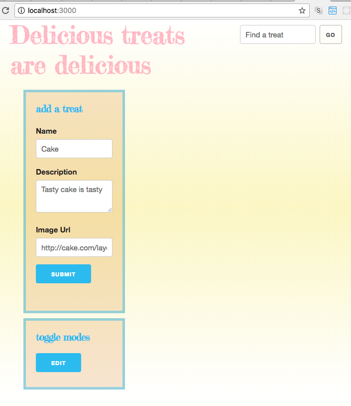
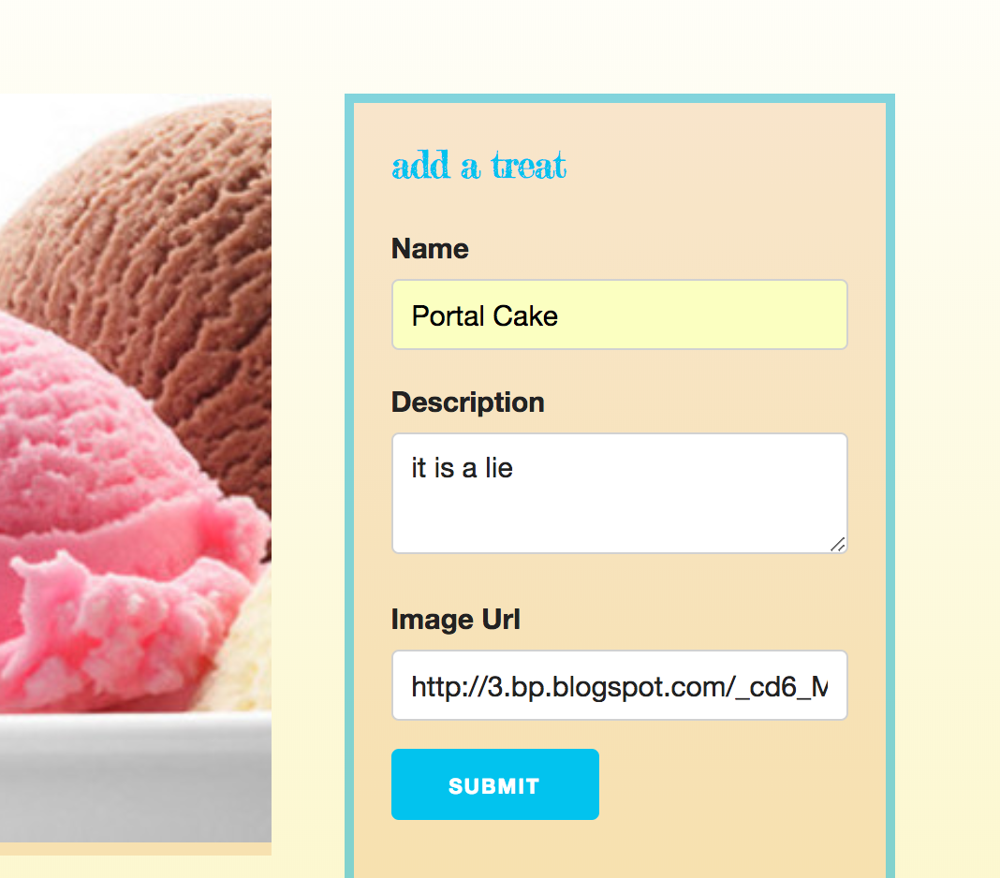
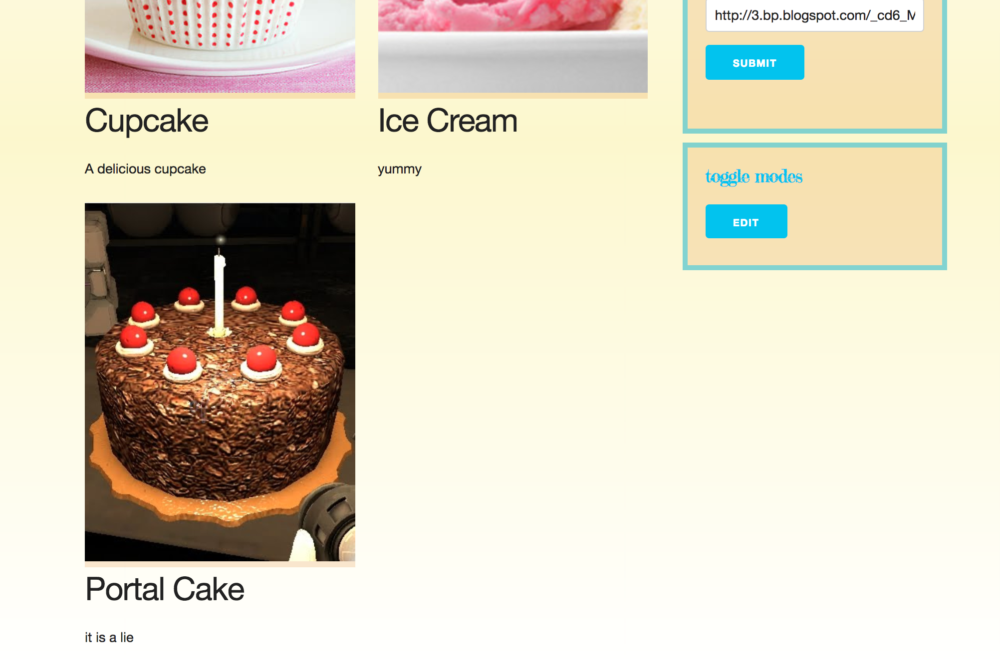
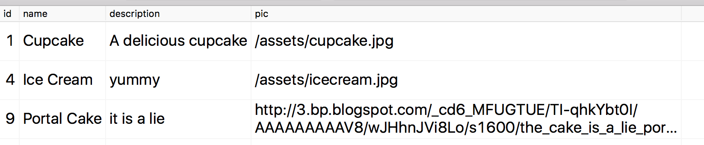

Code Challenge 3: Treats Server-side Code
===

Your front-end developer has created all of the client-side code necessary to view, add, update, and delete treats from the database. 

Your back-end developer has set-up the server to serve back the static files as well as some initial pg and routing code. But none of the routes are implemented. All button clicks on the DOM fail.

## Setup

### Client

You should not need to change the client code at all. In fact, it is minified to discourage you from doing so.

### Server

**IMPORTANT:** Make sure to start postgres!

1. Fork and clone repo.
2. `npm install` to get all dependencies.
3. Setup database as described below.
4. You will need to adjust the pool connection configuration.

### Database

Create a new database named: `sql_code_challenge`

### Create Treats Table

```SQL
-- create table
CREATE TABLE "treats" (
	"id" SERIAL PRIMARY KEY,
	"name" varchar(255),
	"description" text,
	"pic" varchar(255)
);

-- Add some data
INSERT INTO treats ("name", "description", "pic")
VALUES 
('Cupcake', 'A delicious cupcake', '/assets/cupcake.jpg'),
('Donuts', 'Mmmm donuts', '/assets/donuts.jpg');

```

### Test your project

Run `npm start` to start the server. Open http://localhost:3000/ in your browser and you should see something like the following:



It seems to be missing the data you just added to your database.

## TODO

---

### Base Mode

Create the routes and SQL queries necessary to respond to the requests from the client side to return all treats, add new treats, delete treats, and edit treat descriptions. 

You will need:

- [ ] `GET /treats` should return all treats from the database.

- [ ] `DELETE /treats/<id>` Deletes a specific treat. Note that the Mode Toggle button in the interface will display the delete button for each treat.

- [ ] `POST /treats` expects a treat name, description and link to a url image. There are images provided in `/server/public/assets`

- [ ] `PUT /treats/<id>` updates the treat description (the edit button is also displayed with the Mode Toggle button).


Once working you should be able to enter new treat info as such:



After adding the treat the page should update:



And the new info should be in your table:




---


### Stretch Goal

**If you're feeling fancy and have some time to spare**, try this one. You might need to research query strings and express. 

- [ ] `GET /treats?q=donut` should return only treats that match the query parameter.

---

*Remember to use best practices:*

- add, commit, and push working code at regular intervals
- update the project's readme.md

---
